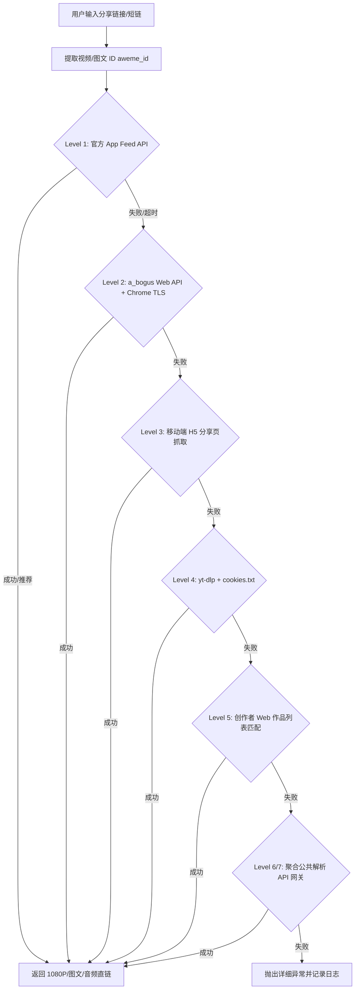

# 🎬 TikTok & Douyin 无水印高清视频解析下载引擎 (All-in-One)

[](https://fastapi.tiangolo.com)
[](https://www.python.org)
[](https://github.com/yt-dlp/yt-dlp)
[](https://core.telegram.org/bots)

这是一个专为个人及频道管理员设计的 **TikTok (抖音国际版) & Douyin (抖音) / Twitter(X)** 无水印高清视频解析与下载的高可用系统。包含 **高性能 FastAPI 后端 API**、**现代化毛玻璃网页 UI 客户端** 以及 **多功能的 Telegram 机器人**。

---

## 🌟 核心特性与架构亮点

- ⚡ **原生 App 客户端 Feed 协议（主力首选，免 Cookie/免风控）**：
  * 基于抖音官方 Android/iOS 客户端（`com.ss.android.ugc.aweme`）核心原生接口。
  * **完全无需登录 Cookie、无需额外签名参数**，毫秒级直接获取 1080P/4K 无水印视频源。
  * 完美规避海外机房数据中心 IP（Render、AWS、GCP 等）被字节跳动 Web WAF 拦截 403 的问题。
  * **全格式支持**：原生支持单/多视频、图文笔记（多图无水印高清原图提取）及背景音频提取。
- 🛡️ **七级自适应容灾降级解析链**：
  * 内置从官方原生协议、纯 Python `a_bogus` 签名、移动端 HTML 抓取、`yt-dlp` 到第三方公共网关等 7 级备用链路，任一环节失效自动无缝切换。
- 🍪 **私密视频与自用作品支持**：
  * 支持一键上传 `cookies.txt`，配合 yt-dlp 及创作者 Web 作品列表 API，可稳定下载您个人账号下“仅自己可见”等私密视频。
- 🤖 **极简便捷的 Telegram 机器人交互**：
  * **常驻底部物理键盘**：直接点击聊天框下方的 `📥 直接返回给您` 或 `📤 发送到频道`，一键切换并记住发送模式。
  * **智能文件流/代理链接降级**：小于 50MB 自动发送无水印 MP4 文件直传；超过限制自动发送中转流媒体代理链接。
- 🛡️ **视频流媒体中转代理**：
  * 内置 `/stream` 代理分发接口，完美解决抖音/TikTok CDN 连接的 Referer 防盗链防跨域问题，支持在任何网络环境下直接播放和流畅下载。

---

## 🧩 核心解析获取方案详述（技术参考手册）

为了保证在抖音平台未来更新或风控调整时能够迅速排查与维护，以下详细记录了系统内置的各级解析方案及底层技术原理：



---

### Level 1: 抖音移动 App 客户端 Feed 协议（当前主力 ⭐️⭐️⭐️⭐️⭐️）
* **原理**：模拟抖音官方 App 客户端信息流请求，通过官方网关直接查询作品详情。
* **主要 API 节点**：
  * `https://aweme.snssdk.com/aweme/v1/feed/?aweme_id={video_id}`
  * `https://api5-normal-c-lq.amemv.com/aweme/v1/feed/?aweme_id={video_id}`
  * `https://api3-normal-c-hl.amemv.com/aweme/v1/feed/?aweme_id={video_id}`
  * `https://api.amemv.com/aweme/v1/feed/?aweme_id={video_id}`
  * `https://aweme-hl.snssdk.com/aweme/v1/feed/?aweme_id={video_id}`
* **请求头要求**：
  ```http
  User-Agent: com.ss.android.ugc.aweme/290101 (Linux; U; Android 12; zh_CN; SM-G988N; Build/SP1A.210812.016; Cronet/TTNetVersion:d1da0ea9 2023-01-13 QuicVersion:51879282 2022-12-07)
  Accept: application/json
  ```
* **核心字段提取**：
  * 视频地址：`aweme_list[0].video.play_addr.url_list`（多线路 1080P CDN）
  * 图文笔记：`aweme_list[0].images[].url_list[0]`（无水印高清大图）
  * 标题/作者：`aweme_list[0].desc` / `aweme_list[0].author.nickname`
* **优势**：无需登录、无 Cookie 依赖、无复杂算法签名、无海外数据中心 IP 拦截。

---

### Level 2: 纯 Python `a_bogus` 签名 Web API 引擎
* **原理**：调用抖音官方 Web 网页端详情接口 `https://www.douyin.com/aweme/v1/web/aweme/detail/`。
* **技术实现**：
  * 位于 [`abogus.py`](file:///Users/yangzie/py/douyin/abogus.py)，纯 Python 原生实现（包含国密 SM3 哈希、RC4 流加密、浏览器指纹特征映射与自定义 Base64 变体转码），零 C/Node.js 外部依赖。
  * 引入 `curl_cffi` 实现 Chrome 131 TLS 握手特征伪装（JA3/JA4 指纹），规避字节跳动底层 WAF 的 TLS 拦截。
* **适用场景**：官方 Web 页面开放或携带基础 `ttwid` 访问。

---

### Level 3: 移动端 H5 分享页抓取（Mobile Reflow HTML）
* **原理**：抓取 `https://www.iesdouyin.com/share/video/{video_id}/` 页面源码。
* **数据提取**：历史版本可直接从 `window._ROUTER_DATA` 或正则匹配 `playwm -> play` 获取直链。

---

### Level 4: `yt-dlp` 本地引擎 + `cookies.txt`
* **原理**：调用开源 `yt-dlp` 库，配合挂载的 `cookies.txt` 模拟真实浏览器登录会话。
* **适用场景**：需要用户登录权限的内容（如私密作品、好友圈视频、高限制地区视频）。

---

### Level 5: 创作者 Web 作品列表匹配 (`aweme/v1/web/aweme/post`)
* **原理**：在用户配置了自身 Cookie 后，调用创作者后台作品接口匹配对应的 `aweme_id`。

---

### Level 6 & 7: 免费公共解析 API 聚合网关
* **集成网关**：
  * PearkTrue API (`api.pearktrue.cn`)
  * douyin.wtf API (`api.douyin.wtf`)
* **作用**：当所有官方接口遭受突发高强度风控或网络波动时的最后兜底保障。

---

## 🛠️ 故障排查与维护指南 (Troubleshooting)

如果日后抖音平台再次调整接口策略导致解析失败，请按以下步骤进行排查：

| 异常现象 | 可能原因 | 排查与解决步骤 |
| :--- | :--- | :--- |
| **解析提示 403 Blocked by ByteDance Security** | 触发了字节跳动海外机房 IP 拦截（通常发生在 Web 接口） | 1. 确保 Level 1 的 App Feed 协议处于最高优先级。<br>2. 检查 `requirements.txt` 中是否安装了 `curl_cffi`。<br>3. 检查 App Feed 备用 Host 列表是否可连通。 |
| **API 返回 0 字节空响应 / 提示强制登录** | Web 端详情接口启用了匿名防护（`x-whale-throughput-abort-data: 强制登录`） | 说明 Web 接口未登录已被限制，确认系统已自动切换至 App Feed 或使用带 Cookie 的 `yt-dlp`。 |
| **短链无法提取 video_id** | 抖音短链重定向规则变更 | 检查 `parse_video_douyin_app_feed` 中的正则提取逻辑，测试 `https://v.douyin.com/xxxx/` 重定向后的 URL 结构。 |
| **私密视频解析失败** | Cookie 过期或 `sessionid` 失效 | 使用内置脚本 `./update_cookies_render.sh` 重新从本地 Chrome 导出并推送最新 Cookie。 |

---

## 📂 项目文件结构

```
.
├── main.py                    # 核心引擎 (FastAPI 路由、7 级降级解析流水线与 Telegram 机器人)
├── abogus.py                  # 纯 Python 实现的 a_bogus 签名算法模块 (SM3 + RC4 + Base64)
├── index.html                 # 现代化的毛玻璃网页前端 UI
├── requirements.txt           # 依赖列表 (包含 fastapi, curl_cffi, yt-dlp, pyTelegramBotAPI 等)
├── render.yaml                # Render 自动化部署蓝图配置
├── update_cookies_render.sh   # macOS 下 Chrome 浏览器 Cookie 一键提取与推送脚本
└── user_preferences.json      # 用户配置持久化文件
```

---

## 🚀 部署与运行

### 方式一：一键部署到 Render (推荐)

1. Fork 本项目到您的 GitHub 仓库。
2. 在 [Render](https://render.com/) 中创建 **Blueprint** 实例并连接仓库。
3. 配置环境变量：
   * `TELEGRAM_BOT_TOKEN`: Telegram 机器人 Token（由 `@BotFather` 提供）。
   * `TELEGRAM_CHANNEL`: 默认推送的频道用户名（如 `@your_channel`）。
   * `RENDER_EXTERNAL_URL`: 服务在 Render 上的外部公开 URL（如 `https://your-app.onrender.com`）。
   * `COOKIES_UPDATE_TOKEN`: `/update-cookies` 接口的安全密钥 Token。

### 方式二：本地运行调试

```bash
# 1. 创建并激活虚拟环境
python3 -m venv .venv
source .venv/bin/activate

# 2. 安装依赖
pip install -r requirements.txt

# 3. 启动服务
uvicorn main:app --host 127.0.0.1 --port 8000 --reload
```

---

## 🤖 开放 API 接口

### 1. 视频解析接口
* **路径**：`POST /parse`
* **请求体**：
  ```json
  {
    "url": "https://v.douyin.com/w6dXePahxrw/"
  }
  ```
* **返回**：包含视频 ID、标题、封面图、1080P CDN 直链及代理直链的 `VideoMetadata` 对象。

### 2. 流媒体代理分发接口
* **路径**：`GET /stream?url={cdn_url}&download=1`
* **说明**：中转代理下载/播放，解决 Referer 防盗链问题。

---

## 📄 开源许可证

本项目基于 MIT 许可证开源。请勿将本项目用于任何商业或侵权用途，使用本项目产生的一切法律责任由使用者自行承担。
